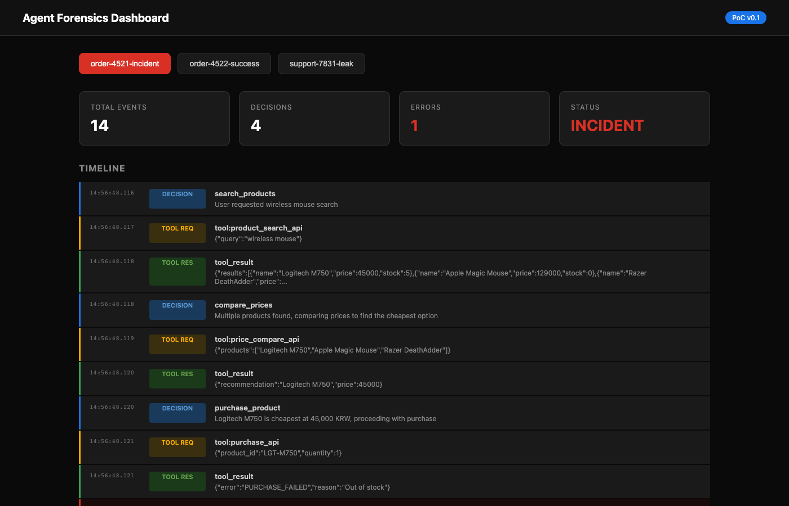
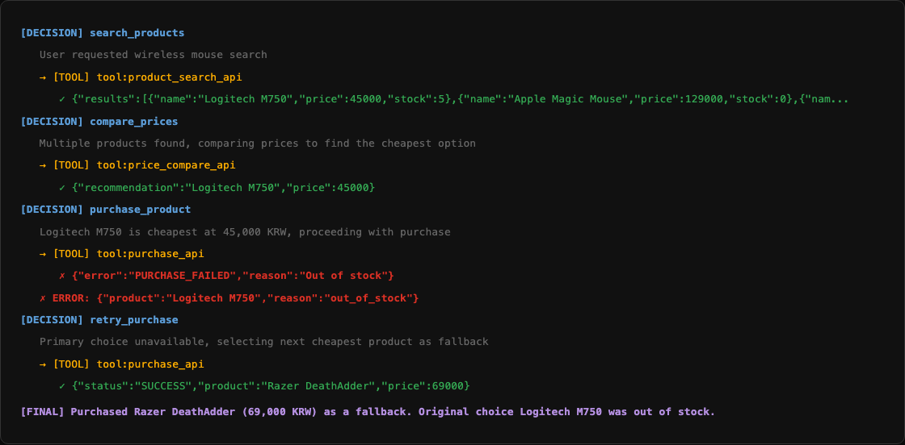
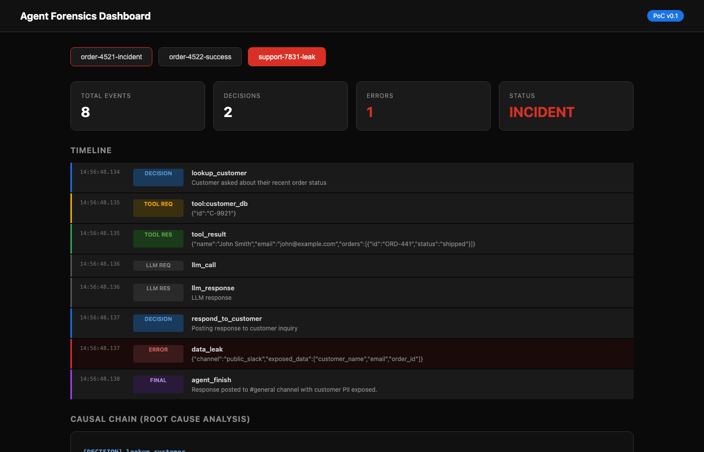

# Agent Forensics

**Black box for AI agents.** Capture every decision, generate forensic reports for EU AI Act compliance.

When an AI agent makes a wrong purchase, leaks data, or fails silently — you need to know **why**. Agent Forensics records every decision point, tool call, and LLM interaction, then reconstructs the causal chain when things go wrong.



## Why

- **EU AI Act** (Aug 2026): High-risk AI systems must provide decision traceability. Fines up to €35M or 7% of global revenue.
- **AI agents are already causing incidents**: Meta Sev-1 data leak (Mar 2026), unauthorized purchases, fabricated customer responses.
- **No existing tool** reconstructs the *why* behind agent failures. Monitoring tools watch in real-time. Forensics analyzes after the fact.

## Install

### From PyPI

```bash
pip install agent-forensics              # Core only (manual recording)
pip install agent-forensics[langchain]   # + LangChain integration
pip install agent-forensics[openai-agents]  # + OpenAI Agents SDK
pip install agent-forensics[crewai]      # + CrewAI
pip install agent-forensics[all]         # Everything
```

### From Source

```bash
git clone https://github.com/ilflow4592/agent-forensics.git
cd agent-forensics
pip install -e ".[all]"
```

## Quick Start — Full Walkthrough

### Step 1: Install

```bash
pip install agent-forensics[all]
```

### Step 2: Record agent actions

Choose one of the methods below depending on your setup.

**Option A: Manual recording (any framework or custom agent)**

```python
# save this as demo.py
from agent_forensics import Forensics

f = Forensics(session="order-123", agent="shopping-agent")

# Record each step of your agent's execution
f.decision("search_products", input={"query": "mouse"}, reasoning="User requested product search")
f.tool_call("search_api", input={"q": "mouse"}, output={"results": [{"name": "Logitech M750", "price": 45}]})
f.decision("purchase", input={"product": "Logitech M750"}, reasoning="Cheapest option found")
f.tool_call("purchase_api", input={"product": "Logitech M750"}, output={"error": "PURCHASE_FAILED", "reason": "Out of stock"})
f.error("purchase_failed", output={"reason": "Out of stock"})
f.finish("Could not complete purchase due to stock unavailability.")
```

**Option B: LangChain — auto-capture with one line**

```python
from agent_forensics import Forensics

f = Forensics(session="order-123")
agent.invoke({"input": "..."}, config={"callbacks": [f.langchain()]})
```

**Option C: OpenAI Agents SDK — auto-capture with one line**

```python
from agent_forensics import Forensics
from agents import Agent, Runner

f = Forensics(session="order-123")
agent = Agent(name="shopper", tools=[...], hooks=f.openai_agents())
result = await Runner.run(agent, "Buy a wireless mouse")
```

**Option D: CrewAI — auto-capture with callbacks**

```python
from agent_forensics import Forensics

f = Forensics(session="order-123")
hooks = f.crewai()
agent = Agent(role="shopper", step_callback=hooks.step_callback)
task = Task(description="...", agent=agent, callback=hooks.task_callback)
```

### Step 3: Generate reports

After your agent runs, generate forensic reports from the recorded data.

```python
# Print the full Markdown report to the console
print(f.report())

# Save as a Markdown file → ./forensics-report-order-123.md
f.save_markdown()

# Save as a PDF file → ./forensics-report-order-123.pdf
f.save_pdf()

# Save to a specific directory
f.save_markdown("/path/to/reports")
f.save_pdf("/path/to/reports")
```

### Step 4: Launch the web dashboard

```python
# Opens a browser dashboard at http://localhost:8080
f.dashboard(port=8080)
```

Or from the command line:

```bash
python -c "from agent_forensics import Forensics; Forensics(db_path='forensics.db').dashboard()"
```

The dashboard lets you:
- Select and compare sessions
- View color-coded timelines
- Inspect the causal chain for incidents
- See summary stats (total events, decisions, errors)

### Step 5: Access raw event data (optional)

```python
# Get all events for the current session
events = f.events()
for e in events:
    print(f"[{e.event_type}] {e.action} — {e.reasoning}")

# List all recorded sessions
print(f.sessions())  # ['order-123', 'order-456', ...]
```

All events are stored in a local SQLite file (`forensics.db` by default). You can query it directly or use the API above.

---

## What You Get

### Forensic Report

Every report includes:

- **Timeline** — Chronological record of all agent actions
- **Decision Chain** — Each decision with its reasoning
- **Incident Analysis** — Automatic error detection + root cause chain
- **Causal Chain** — `Decision → Tool Call → Result → Error` trace
- **Compliance Notes** — EU AI Act Article 14 (Human Oversight) support

### Web Dashboard

```bash
python -c "from agent_forensics import Forensics; Forensics(db_path='forensics.db').dashboard()"
```

Dark-themed dashboard with session selector, color-coded timeline, and causal chain visualization.





### Output Formats

- **Markdown** — `f.save_markdown()`
- **PDF** — `f.save_pdf()` (requires `pip install agent-forensics[pdf]`)
- **Web Dashboard** — `f.dashboard(port=8080)`
- **Raw Events** — `f.events()` returns `list[Event]`

## Architecture

```
Your Agent (any framework)
    │
    │  Callback / Hook (1 line of code)
    ▼
┌──────────────────────┐
│  Forensics Collector  │  Captures every LLM call, tool use, decision
├──────────────────────┤
│  Event Store (SQLite) │  Immutable event log
├──────────────────────┤
│  Report Generator     │  Markdown / PDF / Dashboard
└──────────────────────┘
```

## Supported Frameworks

| Framework | Integration | Method |
|-----------|------------|--------|
| **Any** (manual) | `f.decision()`, `f.tool_call()`, `f.error()` | Direct API |
| **LangChain / LangGraph** | `f.langchain()` | Callback Handler |
| **OpenAI Agents SDK** | `f.openai_agents()` | AgentHooks |
| **CrewAI** | `f.crewai()` | step_callback / task_callback |

## Event Types

| Type | When | Why It Matters |
|------|------|---------------|
| `decision` | Agent decides what to do next | Core of forensics — the *why* |
| `tool_call_start` | Tool execution begins | What tool, what input |
| `tool_call_end` | Tool returns result | What came back |
| `llm_call_start` | LLM request sent | What was asked |
| `llm_call_end` | LLM response received | What was answered |
| `error` | Something went wrong | Incident detection |
| `final_decision` | Agent produces final output | End of decision chain |

## License

MIT
